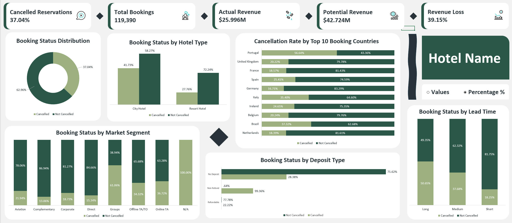

# Hotel Management System Analysis

An Excel-based data analysis project focused on understanding hotel booking cancellations, revenue risk, booking patterns, and key factors associated with cancellation behavior.

The project transforms hotel reservation data into actionable business insights through data preparation, Pivot Tables, Excel formulas, and an interactive dashboard.

---

## Project Overview

The hotel booking dataset contains 119,390 reservations covering the period from July 2015 to August 2018.

The analysis focuses on understanding:

- Booking cancellation patterns
- Revenue impact associated with cancellations
- Differences between hotel types
- Market segment behavior
- Booking country patterns
- Deposit type and cancellation behavior
- Lead time and cancellation risk

The final output is an interactive Excel dashboard designed to help hotel management identify areas of higher cancellation risk and potential revenue exposure.

---

## Business Problem

Hotel cancellations create uncertainty in occupancy planning and revenue forecasting.

The objective of this project is to analyze historical booking data to identify:

- How frequently bookings are cancelled
- Which hotel types and market segments have higher cancellation rates
- Which booking countries contribute significantly to cancellation risk
- How deposit type relates to cancellation behavior
- Whether longer booking lead times are associated with higher cancellation rates
- The estimated revenue exposure associated with cancelled bookings

---

## Objectives

The main objectives of the analysis are to:

1. Measure the overall booking cancellation rate.
2. Estimate potential and actual revenue based on ADR and booking duration.
3. Compare cancellation behavior across hotel types.
4. Analyze cancellation rates across market segments.
5. Identify high-cancellation booking countries.
6. Investigate the relationship between deposit type and cancellations.
7. Examine cancellation behavior across different lead-time categories.
8. Present the findings through an interactive Excel dashboard.

---

## Dataset

The dataset contains **119,390 hotel reservations** covering the period from **July 2015 to August 2018**.

Key fields include information related to:

- Hotel type
- Booking status
- Lead time
- Arrival date
- Number of guests
- Market segment
- Country
- Deposit type
- ADR
- Booking characteristics

The workbook also contains a country mapping table used to support country-level analysis.

---

## Tools & Technologies

- **Microsoft Excel**
- **Power Query**
- **Pivot Tables**
- **Excel Formulas**
- **Excel Charts**
- **Interactive Dashboard**
- **Conditional formatting / Excel formatting**

---

## Data Cleaning & Preparation

Several data-quality issues were identified and handled during the analysis.

### Missing Values

Missing values were identified in fields including:

- Agent
- Company
- Country
- Market Segment

These values were reviewed as part of the data preparation process.

### Anomalous Guest Counts

Two records containing unusually high children/babies values were identified and validated as data-entry errors. They were handled to prevent distortion of the analysis.

### Invalid ADR

A negative ADR value was identified as an invalid record and excluded from revenue calculations after assessing its impact on the analysis.

---

## Analysis

The analysis was structured around several key dimensions:

### Booking Status

Overall distribution of cancelled versus non-cancelled bookings.

### Hotel Type

Comparison of cancellation rates between:

- City Hotels
- Resort Hotels

### Booking Country

Analysis of cancellation rates among the top booking countries.

### Market Segment

Comparison of cancellation behavior across different market segments.

### Deposit Type

Analysis of cancellation rates by:

- No Deposit
- Non Refund
- Refundable

### Lead Time

Comparison of cancellation behavior across:

- Short
- Medium
- Long

---

## Key Performance Indicators

The dashboard highlights the following KPIs:

| KPI | Value |
|---|---:|
| Total Bookings | 119,390 |
| Cancelled Reservations | 37.04% |
| Actual Revenue | $25.996M |
| Potential Revenue | $42.724M |
| Revenue at Risk Rate | 39.15% |

---

## Dashboard

The final dashboard provides an interactive overview of booking cancellations and their associated patterns.

It includes:

- Booking Status Distribution
- Booking Status by Hotel Type
- Cancellation Rate by Top 10 Booking Countries
- Booking Status by Market Segment
- Booking Status by Deposit Type
- Booking Status by Lead Time
- Revenue and booking KPIs
- Hotel filtering functionality



---

## Key Insights

### Overall Cancellation Risk

44,224 of 119,390 reservations were cancelled, representing a **37.04% cancellation rate**. This indicates significant uncertainty in occupancy and revenue forecasting.

### Estimated Revenue at Risk

Based on ADR, potential revenue was estimated at **$42.724M**, while actual revenue was approximately **$25.996M**.

This represents an estimated **$16.728M in revenue at risk**, equivalent to approximately **39.15% of potential revenue**.

### Hotel Type

City Hotels recorded a higher cancellation rate than Resort Hotels:

- City Hotels: **41.73%**
- Resort Hotels: **27.76%**

This indicates a higher level of cancellation risk for City Hotels.

### Booking Country

Among the top 10 booking countries, Portugal generated the highest booking volume and also recorded the highest cancellation rate at **56.64%**.

This makes Portugal both a major booking market and a significant source of cancellation risk.

### Market Segment

Groups recorded the highest cancellation rate among the analyzed market segments at **61.06%**.

This segment should be investigated further, particularly its deposit policy, lead time, and revenue contribution before making decisions about reducing group bookings.

### Deposit Type

Non-refundable bookings showed an exceptionally high cancellation rate of **99.36%**, compared with:

- Refundable: **22.22%**
- No Deposit: **28.38%**

This strong association warrants further investigation into the underlying booking policy, business process, or potential data-quality issues before drawing causal conclusions.

### Lead Time

Long-lead bookings recorded a **50.65% cancellation rate**, compared with only **18.25%** for short-lead bookings.

This suggests that longer lead times are associated with substantially higher cancellation risk.

---

## Business Recommendations

Based on the analysis, hotel management could consider:

1. Investigating the causes of the significantly higher cancellation rate among City Hotel bookings.
2. Reviewing booking behavior and cancellation patterns in Portugal due to its combination of high booking volume and cancellation rate.
3. Investigating Group bookings, particularly their deposit policies, lead times, and revenue contribution.
4. Reviewing the extremely high cancellation rate associated with non-refundable bookings for potential data-quality, policy, or process issues.
5. Considering differentiated cancellation policies, deposits, or reminder strategies for long-lead bookings instead of applying a blanket lead-time restriction.
6. Monitoring cancellation risk alongside revenue exposure rather than relying on cancellation volume alone.

---

## Project Structure

```text
hotel-management-system-analysis/
│
├── excel/
│   └── hotel_management_system_analysis.xlsx
│
├── insights/
│   └── business_insights.md
│
├── screenshots/
│   └── dashboard_overview.png
│
└── README.md
```
## How to Explore the Project

1. Open the Excel workbook located in the excel/ folder.
2. Review the Hotel_Booking_Data sheet for the reservation data.
3. Review the Summary sheet for calculations and analytical outputs.
4. Review the Countries sheet for the country mapping table.
5. Open the Dashboard sheet to explore the final interactive dashboard.
6. Review insights/business_insights.md for the detailed business findings and recommendations.
